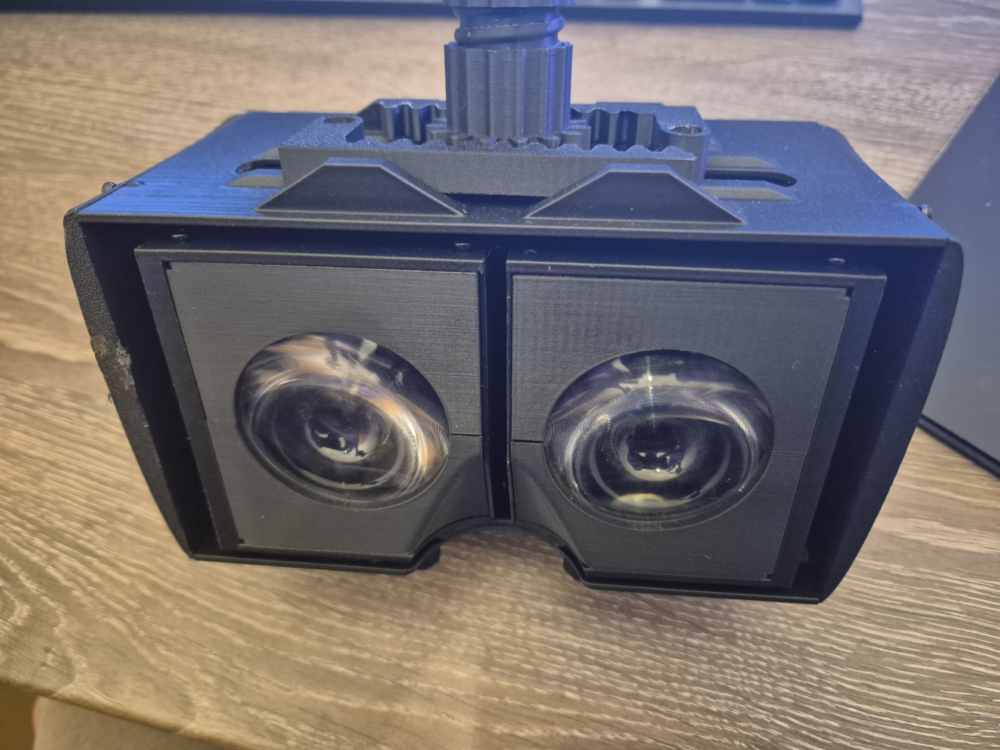

# Custom DIY VR Headset

A fully open, 3D-printable VR headset featuring adjustable IPD, dual-display modules, and integration with **Monado**.  
This repository contains all 3D models, build instructions, and software setup steps required to assemble and run the headset.

---

## Project Overview

This project provides:
- A **hardware design** for a custom VR headset  
- Integration of a **Custom VR** driver in Monado ([Original Project](https://gitlab.freedesktop.org/monado/monado)
---)
- Compiled binaries for [Basalt](https://github.com/CIFASIS/basalt-xr)
---

## Required Tools

 - 3D printer 
 - Metal saw 
 - Heat source (lighter, etc.)
 - Soldering iron

---

## Required Purchased Parts

These parts are used across the headset, primarily for the eye modules.

| Part | Count | Product ID | Vendor |
|------|-------|------------|--------|
| Threaded Rod M3, 55 mm | 4 | B0D5DGMXNN | Amazon |
| Press Insert M3 | 4 | B0CRYWCYMG | Amazon |
| Allen Screw M2 x 4 mm | 40 | B0CKN2VK12 | Amazon |
| Press Insert M2 | 41 | B0CRYWCYMG | Amazon |
| Allen Screw M2 x 6 mm | 1 | B0CKN2VK12 | Amazon |
| Display + Breakout Board | 2 | 1005008477815602 | AliExpress |
| MIPI-to-HDMI Board | 2 | 1005008477815602 | AliExpress |

---

## Assembly 

An assembly video can be seen here: https://youtu.be/JpesEXfNubU but it still needs commentary.
Image of lens module can be seen here.

## Project Status

This is an experimental hardware project intended for research, education, and VR hacking.  
Contributions and improvements are welcome.

---